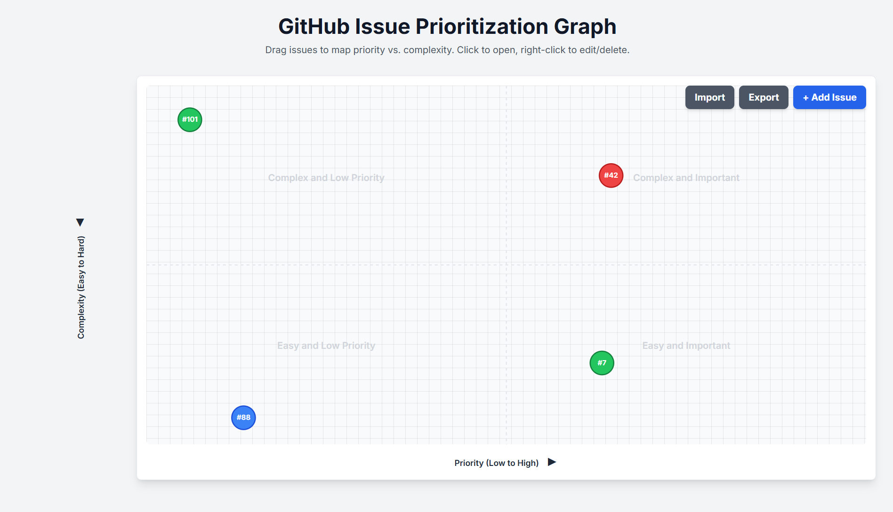

# GitHub Issue Prioritization Graph

A toy project to visually map and prioritize GitHub issues based on **priority** (X-axis) and **technical complexity** (Y-axis).  
Nodes are **draggable**, **clickable**, and **editable** for quick planning and reference.

